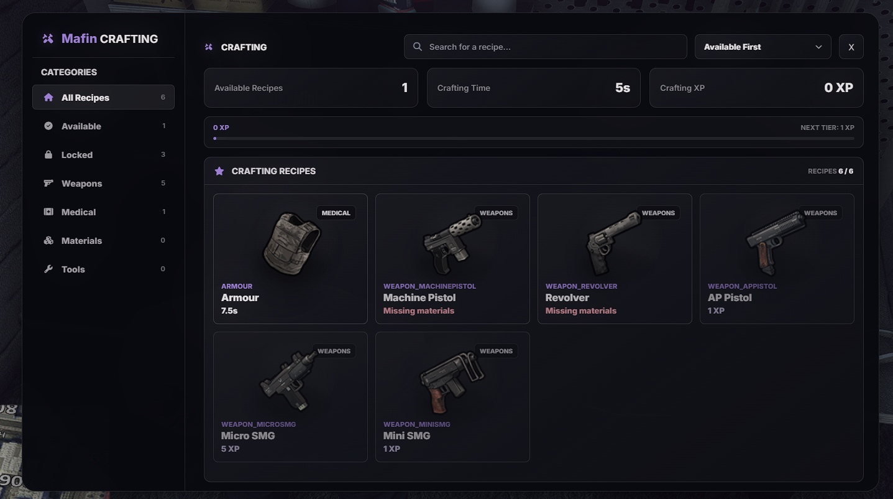

# Mafin Crafting

A lightweight FiveM crafting resource with a monochrome NUI, recipe requirements, XP progression, job restrictions, and configurable crafting benches.

## Preview

## Dependencies

- `es_extended`
- `ox_inventory`
- `ox_target`
- `ox_lib`

Start all dependencies before `mafin_crafting`.

## Installation

1. Copy the `mafin_crafting` folder into your server's resources directory.
2. Add `ensure mafin_crafting` to `server.cfg` after its dependencies.
3. Restart the server or run `refresh` followed by `ensure mafin_crafting` in the server console.

## Configuration

Edit `config.lua` to configure crafting benches, recipes, required materials, crafting duration, XP requirements, rewards, jobs, props, and interaction settings.

Translations are available in:

- `locales/en.lua`
- `locales/cs.lua`

## XP Data

Player crafting XP is stored in `data/mafin_crafting_xp.json`. The resource updates this file automatically.

## Server Commands

Run these commands from the server console:

- `xp_get <playerId>` — display a player's current crafting XP.
- `xp_set <playerId> <amount>` — replace a player's crafting XP.
- `xp_add <playerId> <amount>` — add crafting XP to a player.
